# WorkSync — AI-Powered Team Collaboration & Project Management Platform
## Complete Technical Project Report & Interview Guide

> **Author & Developer:** Rudra Pratap Singh  
> **Core Architecture:** MERN Stack (Node.js 22, Express.js 5, React 19, MongoDB Atlas) + Groq Cloud LLaMA 3.3 Engine + Socket.IO 4  
> **Platform Version:** 1.0.0 Production Ready  
> **Document Status:** Authoritative Master Technical Documentation  
> **Target Audience:** Placement Interviews, Technical Rounds, System Design Viva, Project Presentation, Open-Source Audits  

---

## Table of Contents
1. [Project Overview](#1-project-overview)
2. [Complete Feature Explanation](#2-complete-feature-explanation)
3. [Complete Tech Stack](#3-complete-tech-stack)
4. [Complete Architecture](#4-complete-architecture)
5. [Folder Structure](#5-folder-structure)
6. [Database Documentation](#6-database-documentation)
7. [API Documentation](#7-api-documentation)
8. [Complete Workflow](#8-complete-workflow)
9. [AI Implementation](#9-ai-implementation)
10. [Security](#10-security)
11. [Interview Guide](#11-interview-guide)
12. [Future Scope](#12-future-scope)
13. [Limitations](#13-limitations)
14. [Project Summary & Verification](#14-project-summary--verification)

---

## 1. Project Overview

### 1.1 Project Name
**WorkSync** (internally structured as **DevFlow**) is an enterprise-grade, AI-augmented team collaboration and sprint management ecosystem built on the modern MERN stack.

### 1.2 Objective
The primary objective of WorkSync is to solve the acute disconnect between traditional project tracking boards (which track tasks as abstract text cards) and actual technical delivery (source code, GitHub pull requests, deployable web URLs, and documentation). WorkSync transforms task tracking from a passive checklist into an active, verified delivery pipeline by incorporating real-time bi-directional synchronization, role-isolated portals, and an automated LLM deliverable auditor powered by Groq's high-velocity LLaMA 3.3 engine.

### 1.3 Problem Statement
Modern software engineering organizations, agencies, and distributed freelancing teams face persistent operational bottlenecks:
1. **Verification Latency & Bottlenecks:** Companies and project managers often wait days to review deliverables because inspecting attachments, checking GitHub branches, and opening live demos requires manual context-switching.
2. **Ambiguous Acceptance Criteria:** Developers frequently submit work that fulfills only part of the task prompt because traditional task managers lack strict schema definitions for acceptance criteria.
3. **Disconnected Delivery Channels:** Task assignment happens in Jira or Trello, communication happens in Slack, code resides on GitHub, and deployments reside on Vercel. Stakeholders lack a single source of truth.
4. **Subjective Review Cycles:** When a developer submits work, companies lack immediate, objective verification regarding whether the deliverable matches the initial requirements, leading to prolonged back-and-forth dispute cycles.
5. **Standup Overhead:** Gathering project statistics, progress percentages, and sprint health metrics requires manual calculation and endless status meetings.

### 1.4 Solution
WorkSync provides an integrated, end-to-end digital workplace:
- **Triple-Portal RBAC Isolation:** Granular portals for **Admin**, **Company**, and **Developer** ensure each actor has custom controls, views, and data boundaries.
- **Interactive Real-Time Kanban Sprint Board:** Dynamic task status state machines (To Do → In Progress → Review → Completed) synchronized instantaneously across all connected clients via Socket.IO.
- **Multi-Artifact Deliverable Engine:** Direct submission channels for file attachments, GitHub repositories, and live demonstration URLs with revision histories.
- **Evidence-Based AI Work Verification:** Groq LLaMA 3.3 analyzes submitted deliverables against original task acceptance criteria, providing companies with objective confidence scores, criteria checklists, and technical feedback before final sign-off.
- **Deterministic AI Project Summaries:** Combines real-time mathematical task counts (total, completed, in-progress, velocity) with LLM natural language generation to guarantee 100% mathematical accuracy without hallucination.
- **Real-Time Notification Hub:** Persistent database notifications paired with WebSocket room emissions guarantee zero missed sprint events.

---

## 2. Complete Feature Explanation

WorkSync implements 21 core features. Below is the comprehensive architectural and technical breakdown for every feature.

### 2.1 Authentication
- **What it does:** Provides secure user onboarding, authentication, session initialization, and graceful logout with dual-token security.
- **How it works:** Users register with their full name, email, password, and designated role (`company` or `developer`). The backend hashes the password with `bcryptjs` (salt factor 10), generates an HMAC-SHA256 Access Token (15-minute lifespan) and a Refresh Token (7-day lifespan), stores the hashed refresh token in MongoDB, sets an HTTP-only secure cookie, and returns the access token.
- **Frontend part:** `Login.jsx` and `Register.jsx` forms with input validation, error handling, password masking, and `AuthContext.jsx` for global authentication state.
- **Backend part:** `auth.controller.js` handling `register()`, `login()`, `refreshToken()`, and `logout()` routes.
- **Database involvement:** `User` collection storing `email`, `password` (hashed), `role`, `refreshToken`, and verification status.
- **APIs involved:** `POST /api/v1/auth/register`, `POST /api/v1/auth/login`, `POST /api/v1/auth/refresh`, `POST /api/v1/auth/logout`.
- **Technologies used:** React 19, Axios, Node.js 22, Express.js 5, `bcryptjs`, `jsonwebtoken`, MongoDB Atlas.

### 2.2 JWT (JSON Web Tokens)
- **What it does:** Provides stateless, tamper-proof session validation for all protected REST API requests.
- **How it works:** Tokens contain a signed payload (`{ id: user._id, role: user.role }`). The client attaches the token in the `Authorization: Bearer <token>` HTTP header. Express middleware intercepts incoming requests, decrypts the token via `jwt.verify()`, and attaches `req.user` to the request object. If the access token expires, an Axios interceptor catches the 401 error, invokes `/refresh`, and replays the original request transparently.
- **Frontend part:** `api.js` Axios interceptor managing automatic token injection and refresh replay queue.
- **Backend part:** `auth.middleware.js` verifying token signatures and extracting user identity.
- **Database involvement:** Refresh token rotation stored on the `User` document.
- **APIs involved:** All protected endpoints under `/api/v1/*`.
- **Technologies used:** `jsonwebtoken`, Axios interceptors, HTTP-only Cookies.

### 2.3 Role Based Access Control (RBAC)
- **What it does:** Restricts API execution and frontend route access strictly based on the authenticated user's role: `admin`, `company`, or `developer`.
- **How it works:** The `authorize(...roles)` higher-order middleware checks `req.user.role`. If the user's role is not in the permitted list, the request is immediately terminated with an HTTP 403 Forbidden response. On the frontend, `ProtectedRoute.jsx` checks the user role in `AuthContext` and redirects unauthorized users to their designated dashboard.
- **Frontend part:** `ProtectedRoute.jsx` and conditional UI rendering based on `user.role`.
- **Backend part:** `authorize('company', 'admin')` middleware applied across routes.
- **Database involvement:** `User.role` enum constraint (`['admin', 'company', 'developer']`).
- **APIs involved:** Applied across all project, workspace, task, and admin routes.
- **Technologies used:** Express 5 middleware, React Router v7.

### 2.4 Admin Module
- **What it does:** Provides system administrators with a central management console to inspect all platform users, view pending company verifications, toggle user activation states, and oversee system health.
- **How it works:** Administrators query aggregated platform metrics and pending company accounts. Admins can approve or reject company accounts, deactivating malicious entities across the database.
- **Frontend part:** `AdminDashboard.jsx`, user management tables, status toggle switches, and company approval modals.
- **Backend part:** `user.controller.js` (`getAllUsers()`, `updateUserStatus()`, `verifyCompany()`).
- **Database involvement:** Queries all `User` documents; updates `isVerified` and `isActive` flags.
- **APIs involved:** `GET /api/v1/users`, `PATCH /api/v1/users/:id/status`, `PATCH /api/v1/users/:id/verify`.
- **Technologies used:** React 19, Tailwind CSS v4, Express 5, Mongoose.

### 2.5 Company Module
- **What it does:** Enables registered companies to create workspaces, provision projects, invite developers, assign sprint tasks, inspect deliverables, and trigger AI verifications.
- **How it works:** Companies possess ownership over their workspaces. Only company users can transition tasks to "Completed" or request revisions on submitted work.
- **Frontend part:** `CompanyDashboard.jsx`, Project Management modals, Task Creation drawer, Review portal.
- **Backend part:** `workspace.controller.js`, `project.controller.js`, `task.controller.js`.
- **Database involvement:** `Workspace.owner`, `Project.company`, and `Task.company` referential linkages.
- **APIs involved:** `POST /api/v1/workspaces`, `POST /api/v1/projects`, `POST /api/v1/tasks`, `PATCH /api/v1/tasks/:id/approve`.
- **Technologies used:** React, Axios, Express, Mongoose, Socket.IO.

### 2.6 Developer Module
- **What it does:** Gives software engineers a focused workspace to view assigned tasks, transition cards across sprint boards, participate in task discussions, and submit code deliverables.
- **How it works:** Developers see only projects and tasks to which they have been assigned. They can drag or move tasks from "To Do" to "In Progress", and submit artifacts to move tasks to "Review".
- **Frontend part:** `DeveloperDashboard.jsx`, `TaskBoard.jsx`, submission modals with file/link inputs.
- **Backend part:** `task.controller.js` (`getAssignedTasks()`, `submitWork()`).
- **Database involvement:** `Task.assignee == req.user.id`, `Project.members` array.
- **APIs involved:** `GET /api/v1/tasks/my-tasks`, `POST /api/v1/tasks/:id/submit`.
- **Technologies used:** React 19, Tailwind CSS, Lucide React icons, Axios.

### 2.7 Workspace Management
- **What it does:** Serves as the high-level tenant container grouping teams, projects, and permissions under an enterprise brand.
- **How it works:** A company creates a workspace with a unique slug and name. Projects are provisioned within a workspace. Workspace membership governs developer collaboration.
- **Frontend part:** Workspace switcher dropdown, workspace settings modal.
- **Backend part:** `workspace.controller.js` (`createWorkspace()`, `getWorkspaces()`, `addMember()`).
- **Database involvement:** `Workspace` collection storing `name`, `slug`, `owner`, and `members` array.
- **APIs involved:** `POST /api/v1/workspaces`, `GET /api/v1/workspaces`, `POST /api/v1/workspaces/:id/members`.
- **Technologies used:** Mongoose schemas, Express 5, React Context.

### 2.8 Project Management
- **What it does:** Organizes software initiatives with deadlines, sprint milestones, budgets, descriptions, and assigned developer teams.
- **How it works:** Projects belong to a workspace and a company. Tasks are scoped within a project. Project health and completion percentages are computed from underlying task statuses.
- **Frontend part:** `ProjectList.jsx`, `ProjectDetails.jsx`, create project modal, progress bar components.
- **Backend part:** `project.controller.js` (`createProject()`, `getProjects()`, `getProjectById()`).
- **Database involvement:** `Project` collection with `company` reference, `members` array, and `status` enum.
- **APIs involved:** `POST /api/v1/projects`, `GET /api/v1/projects`, `GET /api/v1/projects/:id`, `PATCH /api/v1/projects/:id`.
- **Technologies used:** Mongoose population, Express, React Router.

### 2.9 Task Management
- **What it does:** Defines atomic units of engineering work with title, description, priority, category, deadline, acceptance criteria, and status.
- **How it works:** Tasks are created by companies or project leads. Tasks progress through a four-stage state machine: `To Do` -> `In Progress` -> `Review` -> `Completed`.
- **Frontend part:** Task creation dialog, task detail view modal, priority badges, deadline countdowns.
- **Backend part:** `task.controller.js` (`createTask()`, `getTasks()`, `updateTask()`, `deleteTask()`).
- **Database involvement:** `Task` collection with `project`, `assignee`, `company`, `status`, and `priority` fields.
- **APIs involved:** `POST /api/v1/tasks`, `GET /api/v1/tasks`, `PATCH /api/v1/tasks/:id`, `DELETE /api/v1/tasks/:id`.
- **Technologies used:** Node.js, Express, Mongoose, React 19.

### 2.10 Task Assignment
- **What it does:** Connects an open task to a specific developer on the project roster.
- **How it works:** The company selects a developer from the workspace member list. The backend updates `Task.assignee`, records an activity log entry, and dispatches an instant real-time notification to the developer's client.
- **Frontend part:** Developer selector dropdown with avatar preview, assignment confirmation toast.
- **Backend part:** `task.controller.js` (`assignTask()`), `socket.js` notification dispatch.
- **Database involvement:** Updates `Task.assignee`, writes to `Notification` collection.
- **APIs involved:** `PATCH /api/v1/tasks/:id/assign`.
- **Technologies used:** Socket.IO rooms, Express, MongoDB.

### 2.11 Interactive Task Board (Kanban)
- **What it does:** Displays sprint tasks organized in visual columns (`To Do`, `In Progress`, `Review`, `Completed`) with real-time card synchronization.
- **How it works:** Status updates trigger local state reconciliation and emit a WebSocket event. All connected team members viewing the board receive the update without page reloads.
- **Frontend part:** `TaskBoard.jsx`, drag/click status transition buttons, task cards with tag filters.
- **Backend part:** `task.controller.js` (`updateTaskStatus()`), emitting `task-updated` via Socket.IO.
- **Database involvement:** Updates `Task.status` and `Task.updatedAt`.
- **APIs involved:** `PATCH /api/v1/tasks/:id/status`.
- **Technologies used:** React state hooks, Tailwind CSS, Lucide icons, Socket.IO client.

### 2.12 Comments & Discussion Threads
- **What it does:** Provides an on-task conversation thread for developers and managers to discuss blockers, architectural questions, and review feedback.
- **How it works:** Authenticated users post comments attached to a specific `taskId`. Comments populate user details (`name`, `avatar`, `role`) and trigger socket broadcasts to the task thread.
- **Frontend part:** `TaskComments.jsx` within task modal, timestamped chat-style feed, markdown support.
- **Backend part:** `comment.controller.js` (`addComment()`, `getComments()`).
- **Database involvement:** `Comment` collection storing `task`, `author`, `content`, and timestamps.
- **APIs involved:** `POST /api/v1/tasks/:taskId/comments`, `GET /api/v1/tasks/:taskId/comments`.
- **Technologies used:** Mongoose population, Socket.IO, React 19.

### 2.13 File Uploads
- **What it does:** Enables developers to upload zip archives, PDF specifications, code snippets, and screenshots directly to a task or submission.
- **How it works:** Multipart/form-data requests are intercepted by `multer` disk storage middleware. Files are validated for extension and size (10MB limit), renamed with unique timestamps, saved to `backend/uploads/`, and exposed via the Express static `/uploads` route.
- **Frontend part:** File dropzone input, upload progress indicator, attachment link list.
- **Backend part:** `multer` configuration in `src/middleware/upload.middleware.js`, `attachment.controller.js`.
- **Database involvement:** File paths and metadata stored in `Task.attachments` array.
- **APIs involved:** `POST /api/v1/tasks/:id/attachments`, `POST /api/v1/tasks/:id/submit`.
- **Technologies used:** `multer`, Express static middleware, Axios `FormData`.

### 2.14 GitHub Submission
- **What it does:** Allows developers to submit a public or private GitHub repository link and branch reference as formal proof of work.
- **How it works:** The URL is validated via regex (`github.com/owner/repo`). The link is stored on the submission object and utilized by the AI verification engine to inspect repository structure and commits.
- **Frontend part:** URL validation input with GitHub icon, branch selector.
- **Backend part:** `task.controller.js` (`submitWork()`), validating link structure.
- **Database involvement:** `Task.submission.githubUrl` field.
- **APIs involved:** `POST /api/v1/tasks/:id/submit`.
- **Technologies used:** React regex validation, Express.

### 2.15 Live Project Submission
- **What it does:** Allows developers to provide a deployed production or staging URL (e.g., Vercel, Netlify, AWS) demonstrating the working feature.
- **How it works:** The developer submits the HTTPS URL. The link is saved to the task deliverable record for company inspection and AI verification.
- **Frontend part:** URL input with external preview button.
- **Backend part:** Stored in `Task.submission.liveUrl`.
- **Database involvement:** `Task.submission.liveUrl` string field.
- **APIs involved:** `POST /api/v1/tasks/:id/submit`.
- **Technologies used:** React, Axios, Express.

### 2.16 Review Workflow
- **What it does:** Manages the transition of a task from development to formal evaluation.
- **How it works:** When a developer submits deliverables, the task status changes to `Review`. The company owner receives a high-priority notification and the review drawer displays all submitted files, GitHub links, and live URLs alongside task requirements.
- **Frontend part:** Review banner, submission inspection drawer, compare requirements view.
- **Backend part:** `task.controller.js` (`submitWork()`), status update to `review`.
- **Database involvement:** `Task.status = "review"`, `Task.submission` populated.
- **APIs involved:** `POST /api/v1/tasks/:id/submit`.
- **Technologies used:** Express, Socket.IO, React.

### 2.17 Approval Workflow
- **What it does:** Gives companies the authority to formally approve a deliverable (closing the task) or request revisions (returning the task to "In Progress").
- **How it works:** The company reviews artifacts and AI recommendations. Approving sets `status = "completed"`. Rejecting sets `status = "in-progress"`, saves feedback notes, and alerts the developer.
- **Frontend part:** "Approve Deliverable" and "Request Changes" action buttons with feedback dialog.
- **Backend part:** `task.controller.js` (`approveTask()`, `rejectTask()`).
- **Database involvement:** `Task.status` updated to `completed` or `in-progress`.
- **APIs involved:** `PATCH /api/v1/tasks/:id/approve`, `PATCH /api/v1/tasks/:id/reject`.
- **Technologies used:** Express 5, Mongoose, Socket.IO notifications.

### 2.18 Notifications Hub
- **What it does:** Informs users of assignments, status changes, review submissions, mentions, and company approvals in real-time.
- **How it works:** Whenever a significant sprint action occurs, the backend writes a document to the `Notification` collection and simultaneously emits an event over the user's private Socket.IO room (`user_<userId>`).
- **Frontend part:** `NotificationDropdown.jsx` bell icon, unread counter badge, notification feed, mark-as-read click handlers.
- **Backend part:** `notification.controller.js`, `socket.js` (`emitNotification()`).
- **Database involvement:** `Notification` collection with `recipient`, `type`, `title`, `message`, `isRead`.
- **APIs involved:** `GET /api/v1/notifications`, `PATCH /api/v1/notifications/:id/read`, `PATCH /api/v1/notifications/read-all`.
- **Technologies used:** Socket.IO 4, MongoDB, React 19.

### 2.19 Analytics Dashboard
- **What it does:** Provides executive-level summaries of platform activity, project velocity, task completion distributions, and upcoming deadlines.
- **How it works:** Aggregates MongoDB documents using `$match`, `$group`, and `$count` pipelines to return completion ratios, active developer counts, and urgent task lists.
- **Frontend part:** Stats cards with percentage bars, recent activity timeline, priority distribution chart.
- **Backend part:** `dashboard.controller.js` (`getDashboardStats()`).
- **Database involvement:** Mongoose aggregation across `Project` and `Task` collections.
- **APIs involved:** `GET /api/v1/dashboard/stats`.
- **Technologies used:** MongoDB Aggregation Framework, Express, React, Tailwind CSS.

### 2.20 Search and Filters
- **What it does:** Enables rapid discovery of tasks and projects across large workspaces.
- **How it works:** Frontend search bar filters tasks in real-time by title, description, or tag. Backend query params (`?status=in-progress&priority=high&search=auth`) execute filtered database queries with regex matching.
- **Frontend part:** Filter bar with status dropdown, priority pills, and live search input with debouncing.
- **Backend part:** Dynamic Mongoose query builder in `task.controller.js`.
- **Database involvement:** Indexed queries on `status`, `priority`, and `project`.
- **APIs involved:** `GET /api/v1/tasks?status=...&priority=...&search=...`.
- **Technologies used:** React state, Mongoose query filters.

### 2.21 AI Features (Groq LLM Engine)
- **What it does:** Delivers intelligent sprint analysis, deliverable verification, and task scaffolding via Groq Cloud's ultra-low latency LLaMA 3.3 engine.
- **How it works:** Described in full detail in [Section 9](#9-ai-implementation).
- **Frontend part:** `AISummaryModal.jsx`, `AIVerificationCard.jsx`, `TaskAssistantButton.jsx`.
- **Backend part:** `ai.controller.js`, `groq.service.js`.
- **Database involvement:** Feeds task and project documents into prompt contexts; stores verification results.
- **APIs involved:** `POST /api/v1/ai/project-summary`, `POST /api/v1/ai/verify-work`, `POST /api/v1/ai/task-assistant`.
- **Technologies used:** Groq SDK, LLaMA 3.3 70B Versatile, Express, React.

---

## 3. Complete Tech Stack

### 3.1 Technology Breakdown

#### Frontend Stack
- **React 19 (`react`, `react-dom`):** Core component library utilizing React Server/Client paradigms, hooks, and virtual DOM diffing.
- **Vite 8:** Next-generation frontend build tool providing sub-second HMR (Hot Module Replacement) and optimized production rollup bundling.
- **Tailwind CSS v4:** Modern utility-first CSS framework with JIT (Just-In-Time) compilation and zero runtime overhead.
- **React Router v7 (`react-router-dom`):** Declarative client-side routing, nested layouts, and route protection guards.
- **Axios:** Promise-based HTTP client configured with baseURL, withCredentials, and automatic JWT refresh interceptors.
- **Socket.IO Client (`socket.io-client` v4):** Real-time bi-directional WebSocket client for live sprint synchronization.
- **Lucide React (`lucide-react`):** Crisp, accessible SVG icons.

#### Backend Stack
- **Node.js 22 LTS:** High-performance asynchronous V8 JavaScript runtime.
- **Express.js 5:** Minimalist web framework providing modern async route handlers and robust middleware pipelines.
- **MongoDB Atlas:** Cloud-hosted distributed NoSQL document database.
- **Mongoose 8:** Object Data Modeling (ODM) library providing schema validation, type safety, pre-save middleware, and population.
- **JSON Web Tokens (`jsonwebtoken`):** Cryptographic signing and verification for access and refresh tokens.
- **Bcryptjs (`bcryptjs`):** CPU-cost hashing function for one-way password encryption with salt.
- **Socket.IO (`socket.io` v4):** Scalable WebSocket server handling room-based client grouping and event broadcasting.
- **Multer (`multer` v1.4):** Middleware for handling `multipart/form-data` file uploads with disk storage.
- **Helmet & Morgan:** Security header hardening (`helmet`) and HTTP request logging (`morgan`).
- **CORS (`cors`):** Cross-Origin Resource Sharing middleware enabling secure cross-origin requests.

#### AI & Intelligence Stack
- **Groq Cloud API:** Hardware-accelerated LPU (Language Processing Unit) inference platform.
- **LLaMA 3.3 70B Versatile (`llama-3.3-70b-versatile`):** Flagship open-weights model for reasoning and verification.
- **LLaMA 3.1 8B Instant (`llama-3.1-8b-instant`):** High-speed fallback model ensuring 100% uptime.
- **Custom Prompt Engineering:** Strict system instructions enforcing RFC-8259 JSON output formats.

### 3.2 Technology Mapping Table

| Technology | Purpose in WorkSync | Used In Feature |
| :--- | :--- | :--- |
| **React 19** | Component-based UI rendering, state management, reactive DOM updates | All frontend pages, TaskBoard, Dashboards |
| **Vite 8** | Rapid development bundling, build optimization, asset pipeline | Frontend build system |
| **Tailwind CSS v4** | Responsive layouts, dark/light theme tokens, micro-animations | All UI components |
| **Axios** | REST communication, bearer token injection, 401 refresh interceptors | All API integration services |
| **React Router v7** | Client-side routing, protected routes, dynamic parameter handling | Navigation, Route Guards |
| **Node.js 22** | Non-blocking server runtime, event loop execution | Backend core server |
| **Express.js 5** | REST routing, middleware pipelines, error handling | All API endpoints |
| **MongoDB Atlas** | Document storage, schema flexibility, indexing | All collections & models |
| **Mongoose 8** | ODM schema modeling, referential integrity (`ref`), hooks | Database abstraction layer |
| **JWT** | Stateless authorization tokens, claim validation | Authentication & RBAC |
| **bcryptjs** | Salted password hashing (cost factor 10) | User registration & authentication |
| **Socket.IO 4** | Bi-directional WebSocket communication, user-scoped rooms | Real-time Kanban, Notifications |
| **Multer** | Multipart form handling, disk storage, file validation | Task deliverable attachments |
| **Groq Cloud API** | Ultra-low latency LPU inference for large language models | Project Summary, Work Verification, Task Assistant |
| **Helmet** | HTTP security headers (CSP, XSS, HSTS) | Backend security hardening |
| **Morgan** | Terminal HTTP request logging for debugging | Backend developer logging |

---

## 4. Complete Architecture

### 4.1 High-Level Architecture Diagram

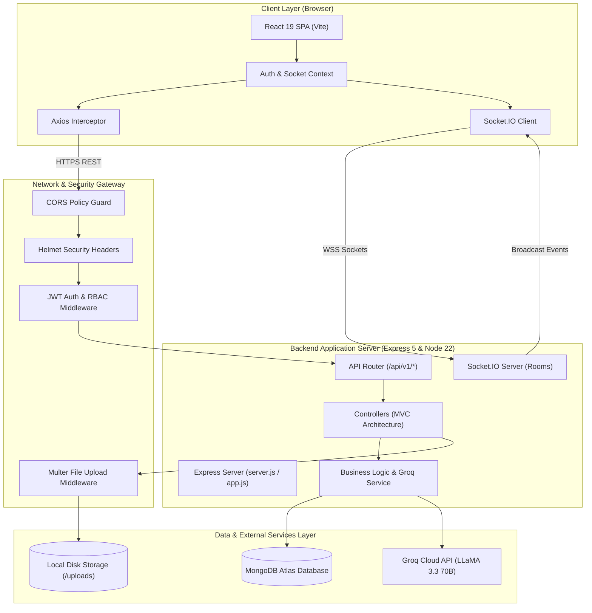

### 4.2 Frontend Architecture

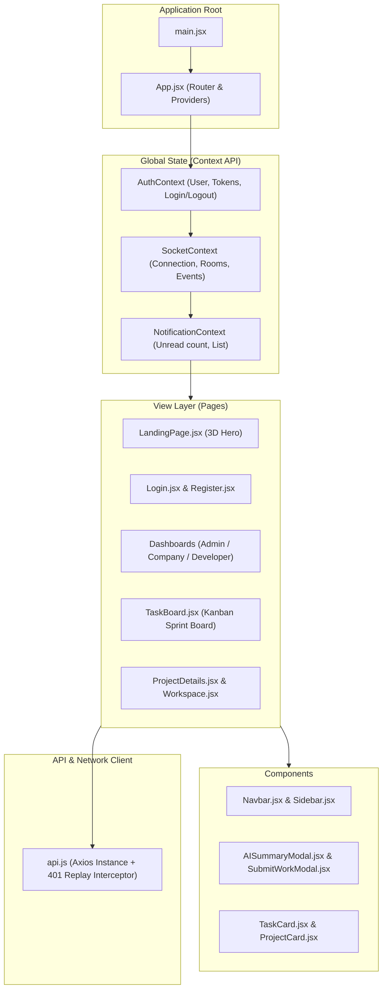

### 4.3 Backend Architecture

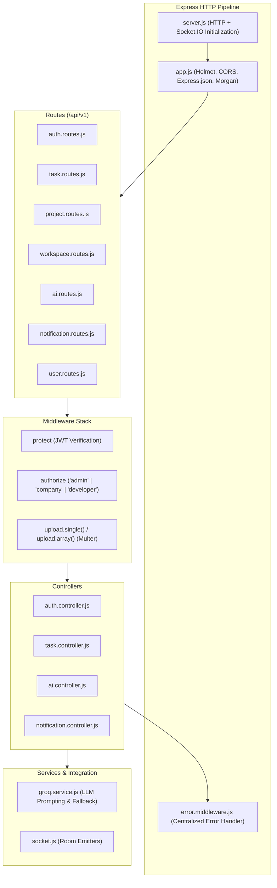

### 4.4 Database Architecture

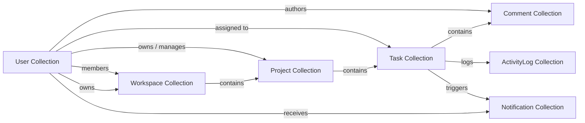

### 4.5 AI Architecture (Groq LLM Pipeline)

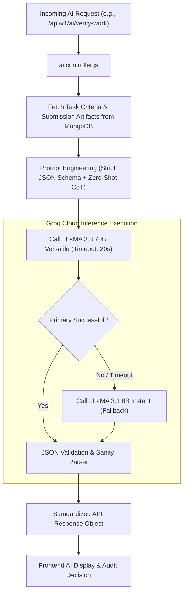

---

## 5. Folder Structure

The WorkSync codebase strictly enforces a clean, modular two-folder architecture (`frontend/` and `backend/`).

```
WorkSync/
├── frontend/
│   ├── public/                      # Static browser assets & favicon
│   ├── src/
│   │   ├── assets/                  # Images, SVGs, and brand graphics
│   │   ├── components/              # Reusable UI building blocks
│   │   │   ├── 3d/                  # CSS 3D Animated Hero element
│   │   │   ├── ai/                  # AI modals (Summary, Verification, Assistant)
│   │   │   ├── common/              # Buttons, inputs, badges, cards, spinners
│   │   │   ├── layout/              # Navbar, Sidebar, Footer, Layout wrapper
│   │   │   ├── notifications/       # Notification dropdown feed & badges
│   │   │   └── tasks/               # Kanban column, TaskCard, Comments drawer
│   │   ├── context/                 # Global state management
│   │   │   ├── AuthContext.jsx      # Authentication state, login/logout, tokens
│   │   │   ├── SocketContext.jsx    # Socket.IO connection & event dispatchers
│   │   │   └── NotificationContext.jsx # Notification state & unread counter
│   │   ├── pages/                   # Application route views
│   │   │   ├── AdminDashboard.jsx   # Admin portal for user/company management
│   │   │   ├── CompanyDashboard.jsx # Company executive view & project metrics
│   │   │   ├── DeveloperDashboard.jsx# Developer view of assigned sprint tasks
│   │   │   ├── LandingPage.jsx      # Marketing page with 3D productivity visual
│   │   │   ├── Login.jsx            # User sign-in form
│   │   │   ├── Register.jsx         # User registration with role selection
│   │   │   ├── ProjectDetails.jsx   # Sprint view, project health, team roster
│   │   │   ├── ProjectList.jsx      # Workspace projects index
│   │   │   └── TaskBoard.jsx        # Interactive 4-column Kanban board
│   │   ├── services/                # API integration layer
│   │   │   ├── api.js               # Central Axios client with JWT refresh interceptor
│   │   │   ├── auth.service.js      # Auth API calls (login, register, logout)
│   │   │   ├── task.service.js      # Task CRUD, status, and submission APIs
│   │   │   ├── project.service.js   # Project CRUD APIs
│   │   │   └── ai.service.js        # Groq AI endpoint calls
│   │   ├── utils/                   # Helper functions (dates, formats, validators)
│   │   ├── App.jsx                  # Main router definitions and ProtectedRoute guards
│   │   ├── index.css                # Tailwind CSS v4 styling rules
│   │   └── main.jsx                 # React 19 entry point mounting to DOM
│   ├── index.html                   # HTML5 template
│   ├── package.json                 # Frontend dependencies (React 19, Tailwind, Vite)
│   └── vite.config.js               # Vite bundler configuration
│
└── backend/
    ├── uploads/                     # Local disk storage for uploaded attachments
    ├── src/
    │   ├── config/                  # Configuration modules
    │   │   ├── db.config.js         # MongoDB Mongoose connection handler
    │   │   └── socket.config.js     # Socket.IO CORS & room configuration
    │   ├── controllers/             # Request handlers (MVC Controller layer)
    │   │   ├── ai.controller.js     # AI endpoints (summary, verify, assistant)
    │   │   ├── attachment.controller.js# Multer file upload & download
    │   │   ├── auth.controller.js   # Auth routes (register, login, refresh, logout)
    │   │   ├── comment.controller.js# Task comment creation & fetching
    │   │   ├── dashboard.controller.js# Aggregated statistics for dashboards
    │   │   ├── notification.controller.js# Notification retrieval & read status
    │   │   ├── project.controller.js# Project lifecycle & team assignment
    │   │   ├── task.controller.js   # Task CRUD, assignment, submission, approval
    │   │   ├── user.controller.js   # User profiles & admin management
    │   │   └── workspace.controller.js# Workspace tenancy & member management
    │   ├── middleware/              # Express request middleware
    │   │   ├── auth.middleware.js   # protect (JWT verification) & authorize (RBAC)
    │   │   ├── error.middleware.js  # Global centralized error handler
    │   │   └── upload.middleware.js # Multer disk storage and file filter
    │   ├── models/                  # Mongoose Schema definitions
    │   │   ├── ActivityLog.model.js # Sprint audit trail logging
    │   │   ├── Comment.model.js     # Task comments schema
    │   │   ├── Notification.model.js# Notification documents schema
    │   │   ├── Project.model.js     # Project schema
    │   │   ├── Task.model.js        # Task schema (with submission subdocuments)
    │   │   ├── User.model.js        # User credentials, roles, refresh tokens
    │   │   └── Workspace.model.js   # Workspace schema
    │   ├── routes/                  # Express route declarations
    │   │   ├── ai.routes.js         # /api/v1/ai routes
    │   │   ├── auth.routes.js       # /api/v1/auth routes
    │   │   ├── dashboard.routes.js  # /api/v1/dashboard routes
    │   │   ├── notification.routes.js# /api/v1/notifications routes
    │   │   ├── project.routes.js    # /api/v1/projects routes
    │   │   ├── task.routes.js       # /api/v1/tasks routes
    │   │   ├── user.routes.js       # /api/v1/users routes
    │   │   └── workspace.routes.js  # /api/v1/workspaces routes
    │   ├── services/                # External service wrappers
    │   │   ├── groq.service.js      # Groq Cloud API LLaMA 3.3 integration
    │   │   └── socket.service.js    # WebSocket room emission helpers
    │   └── utils/                   # Backend utilities (custom errors, token generators)
    ├── app.js                       # Express app configuration & middleware pipeline
    ├── server.js                    # HTTP server instantiation & port listening
    └── package.json                 # Backend dependencies (Express 5, Mongoose 8, etc.)
```

---

## 6. Database Documentation

### 6.1 Entity-Relationship (ER) Diagram

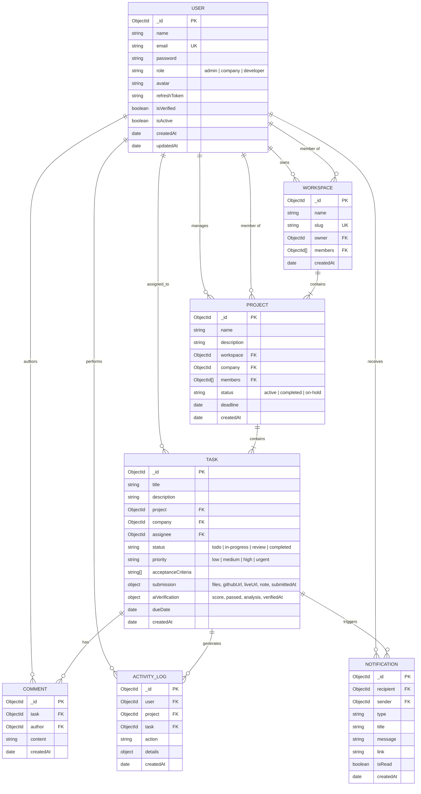

### 6.2 Collections & Field Specifications

#### `User` Collection
- `_id`: ObjectId (Primary Key).
- `name`: String, required, trimmed.
- `email`: String, required, unique, lowercase, trimmed. Indexed for fast credential lookup.
- `password`: String, required. Bcrypt hash with salt factor 10. Excluded from default queries via `.select('-password')`.
- `role`: String enum (`'admin'`, `'company'`, `'developer'`), default `'developer'`.
- `avatar`: String, default placeholder avatar URL.
- `refreshToken`: String, hashed refresh token for token rotation security.
- `isVerified`: Boolean, default `true` for developers, `false` for companies pending admin approval.
- `isActive`: Boolean, default `true`. Allows admins to soft-deactivate accounts.
- `createdAt` / `updatedAt`: Timestamps.

#### `Workspace` Collection
- `_id`: ObjectId (Primary Key).
- `name`: String, required.
- `slug`: String, unique identifier for URLs.
- `owner`: ObjectId, ref `'User'`, required. The company owner of the workspace.
- `members`: Array of ObjectIds, ref `'User'`. Team members who have access to workspace projects.
- `createdAt` / `updatedAt`: Timestamps.

#### `Project` Collection
- `_id`: ObjectId (Primary Key).
- `name`: String, required.
- `description`: String.
- `workspace`: ObjectId, ref `'Workspace'`, required.
- `company`: ObjectId, ref `'User'`, required.
- `members`: Array of ObjectIds, ref `'User'`. Assigned developers.
- `status`: String enum (`'active'`, `'completed'`, `'on-hold'`), default `'active'`.
- `deadline`: Date.
- `createdAt` / `updatedAt`: Timestamps.

#### `Task` Collection
- `_id`: ObjectId (Primary Key).
- `title`: String, required, trimmed.
- `description`: String, required.
- `project`: ObjectId, ref `'Project'`, required, indexed.
- `company`: ObjectId, ref `'User'`, required.
- `assignee`: ObjectId, ref `'User'`, optional.
- `status`: String enum (`'todo'`, `'in-progress'`, `'review'`, `'completed'`), default `'todo'`, indexed.
- `priority`: String enum (`'low'`, `'medium'`, `'high'`, `'urgent'`), default `'medium'`, indexed.
- `acceptanceCriteria`: Array of Strings. Defines objective completion gates for developers and AI verification.
- `submission`: Subdocument containing:
  - `files`: Array of `{ name: String, path: String, size: Number }`.
  - `githubUrl`: String (URL).
  - `liveUrl`: String (URL).
  - `developerNote`: String.
  - `submittedAt`: Date.
- `aiVerification`: Subdocument containing:
  - `confidenceScore`: Number (0–100).
  - `verdict`: String (`'passed'`, `'needs-revision'`, `'flagged'`).
  - `criteriaAnalysis`: Array of `{ criteria: String, satisfied: Boolean, explanation: String }`.
  - `verifiedAt`: Date.
- `dueDate`: Date.
- `createdAt` / `updatedAt`: Timestamps.

#### `Comment` Collection
- `_id`: ObjectId (Primary Key).
- `task`: ObjectId, ref `'Task'`, required, indexed.
- `author`: ObjectId, ref `'User'`, required.
- `content`: String, required.
- `createdAt` / `updatedAt`: Timestamps.

#### `Notification` Collection
- `_id`: ObjectId (Primary Key).
- `recipient`: ObjectId, ref `'User'`, required, indexed.
- `sender`: ObjectId, ref `'User'`.
- `type`: String enum (`'assignment'`, `'status_change'`, `'review_submitted'`, `'approved'`, `'rejected'`, `'comment'`).
- `title`: String, required.
- `message`: String, required.
- `link`: String (target route).
- `isRead`: Boolean, default `false`, indexed.
- `createdAt`: Date, timestamped.

---

## 7. API Documentation

Complete REST API reference table matching the 7 standard architectural criteria:

| HTTP Method | Endpoint | Purpose | Authentication | Role | Controller | Model |
| :--- | :--- | :--- | :--- | :--- | :--- | :--- |
| **Auth APIs** | | | | | | |
| `POST` | `/api/v1/auth/register` | Register new user account | Public | Any | `auth.controller.js` | `User` |
| `POST` | `/api/v1/auth/login` | Authenticate user & issue tokens | Public | Any | `auth.controller.js` | `User` |
| `POST` | `/api/v1/auth/refresh` | Exchange refresh token for new access token | Cookie / Body | Any | `auth.controller.js` | `User` |
| `POST` | `/api/v1/auth/logout` | Invalidate refresh token & clear cookie | Protected (JWT) | Any | `auth.controller.js` | `User` |
| `GET` | `/api/v1/auth/me` | Return currently authenticated user profile | Protected (JWT) | Any | `auth.controller.js` | `User` |
| **User APIs** | | | | | | |
| `GET` | `/api/v1/users` | List all platform users (with pagination) | Protected (JWT) | `admin` | `user.controller.js` | `User` |
| `GET` | `/api/v1/users/:id` | Get specific user profile details | Protected (JWT) | Any | `user.controller.js` | `User` |
| `PATCH` | `/api/v1/users/:id/status`| Deactivate or activate user account | Protected (JWT) | `admin` | `user.controller.js` | `User` |
| `PATCH` | `/api/v1/users/:id/verify`| Approve pending company registration | Protected (JWT) | `admin` | `user.controller.js` | `User` |
| `GET` | `/api/v1/users/developers`| List verified developers for assignment | Protected (JWT) | `company`, `admin` | `user.controller.js` | `User` |
| **Workspace APIs** | | | | | | |
| `POST` | `/api/v1/workspaces` | Create new tenant workspace | Protected (JWT) | `company`, `admin` | `workspace.controller.js` | `Workspace` |
| `GET` | `/api/v1/workspaces` | Get workspaces user has access to | Protected (JWT) | Any | `workspace.controller.js` | `Workspace` |
| `GET` | `/api/v1/workspaces/:id` | Get specific workspace details & roster | Protected (JWT) | Member | `workspace.controller.js` | `Workspace` |
| `POST` | `/api/v1/workspaces/:id/members`| Add developer to workspace roster | Protected (JWT) | `company`, `admin` | `workspace.controller.js` | `Workspace` |
| **Project APIs** | | | | | | |
| `POST` | `/api/v1/projects` | Provision new project within workspace | Protected (JWT) | `company`, `admin` | `project.controller.js` | `Project` |
| `GET` | `/api/v1/projects` | Get all projects accessible to user | Protected (JWT) | Any | `project.controller.js` | `Project` |
| `GET` | `/api/v1/projects/:id` | Get detailed project view & member list | Protected (JWT) | Any | `project.controller.js` | `Project` |
| `PATCH` | `/api/v1/projects/:id` | Update project status, deadline, details | Protected (JWT) | `company`, `admin` | `project.controller.js` | `Project` |
| `DELETE` | `/api/v1/projects/:id` | Soft-delete or archive project | Protected (JWT) | `company`, `admin` | `project.controller.js` | `Project` |
| **Task APIs** | | | | | | |
| `POST` | `/api/v1/tasks` | Create new task within project | Protected (JWT) | `company`, `admin` | `task.controller.js` | `Task` |
| `GET` | `/api/v1/tasks` | Get filtered tasks (by project, status, etc.) | Protected (JWT) | Any | `task.controller.js` | `Task` |
| `GET` | `/api/v1/tasks/:id` | Get single task details with criteria | Protected (JWT) | Any | `task.controller.js` | `Task` |
| `PATCH` | `/api/v1/tasks/:id` | Edit task fields (title, priority, deadline) | Protected (JWT) | `company`, `admin` | `task.controller.js` | `Task` |
| `PATCH` | `/api/v1/tasks/:id/status`| Transition task status across Kanban board | Protected (JWT) | Assignee / Owner | `task.controller.js` | `Task` |
| `PATCH` | `/api/v1/tasks/:id/assign`| Assign task to a specific developer | Protected (JWT) | `company`, `admin` | `task.controller.js` | `Task` |
| `DELETE` | `/api/v1/tasks/:id` | Delete task card | Protected (JWT) | `company`, `admin` | `task.controller.js` | `Task` |
| **Submission APIs** | | | | | | |
| `POST` | `/api/v1/tasks/:id/submit` | Submit work artifacts (files, GitHub, Live) | Protected (JWT) | Assignee (`dev`) | `task.controller.js` | `Task` |
| `PATCH` | `/api/v1/tasks/:id/approve`| Approve task submission (mark completed) | Protected (JWT) | `company`, `admin` | `task.controller.js` | `Task` |
| `PATCH` | `/api/v1/tasks/:id/reject` | Request revisions (return to in-progress) | Protected (JWT) | `company`, `admin` | `task.controller.js` | `Task` |
| **Comment APIs** | | | | | | |
| `POST` | `/api/v1/tasks/:taskId/comments` | Post comment on task discussion thread | Protected (JWT) | Project Member | `comment.controller.js` | `Comment` |
| `GET` | `/api/v1/tasks/:taskId/comments` | Retrieve all comments for task | Protected (JWT) | Project Member | `comment.controller.js` | `Comment` |
| **Notification APIs** | | | | | | |
| `GET` | `/api/v1/notifications` | Get user notifications feed | Protected (JWT) | Recipient | `notification.controller.js`| `Notification` |
| `PATCH` | `/api/v1/notifications/:id/read` | Mark single notification as read | Protected (JWT) | Recipient | `notification.controller.js`| `Notification` |
| `PATCH` | `/api/v1/notifications/read-all` | Mark all user notifications as read | Protected (JWT) | Recipient | `notification.controller.js`| `Notification` |
| **Dashboard APIs** | | | | | | |
| `GET` | `/api/v1/dashboard/stats` | Get aggregated metrics for dashboard | Protected (JWT) | Any (Role-tailored) | `dashboard.controller.js` | Multiple |
| **AI APIs** | | | | | | |
| `POST` | `/api/v1/ai/project-summary` | Generate deterministic project health summary | Protected (JWT) | `company`, `admin` | `ai.controller.js` | `Project`, `Task` |
| `POST` | `/api/v1/ai/verify-work` | Audit submitted deliverables with Groq LLaMA | Protected (JWT) | `company`, `admin` | `ai.controller.js` | `Task` |
| `POST` | `/api/v1/ai/task-assistant` | Scaffold task subtasks & acceptance criteria | Protected (JWT) | `company`, `admin` | `ai.controller.js` | None (Direct) |

---

## 8. Complete Workflow

Below are the 12 complete engineering workflows visualized with detailed sequence diagrams.

### 8.1 Registration Flow

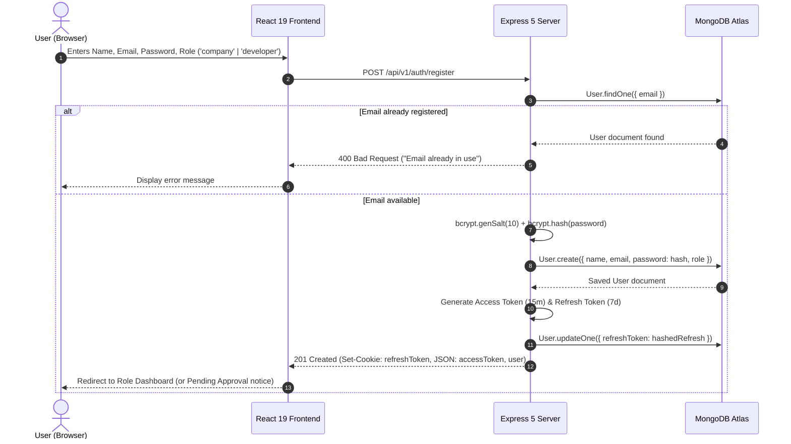

### 8.2 Login Flow

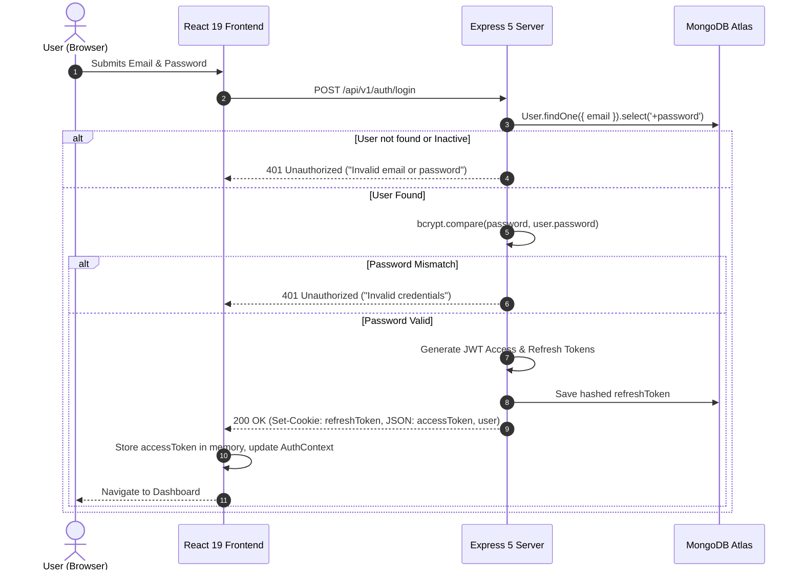

### 8.3 JWT Authentication & Interceptor Flow

```mermaid
sequenceDiagram
    autonumber
    participant React as React Component
    participant Axios as Axios Client (api.js)
    participant Server as Express Backend
    participant JWT as JWT Auth Middleware

    React->>Axios: Call API: GET /api/v1/projects
    Axios->>Axios: Attach Header "Authorization: Bearer <accessToken>"
    Axios->>Server: HTTP Request
    Server->>JWT: protect(req, res, next)
    alt Token Valid
        JWT->>JWT: jwt.verify(token, ACCESS_SECRET)
        JWT->>Server: req.user = decoded; next()
        Server-->>Axios: 200 OK (Data Payload)
        Axios-->>React: Return data
    else Token Expired (401)
        JWT-->>Server: Throw TokenExpiredError
        Server-->>Axios: 401 Unauthorized ("Token expired")
        Axios->>Server: POST /api/v1/auth/refresh (Cookie included)
        Server->>Server: Validate refreshToken
        Server-->>Axios: 200 OK (New accessToken)
        Axios->>Axios: Update Authorization Header
        Axios->>Server: Replay Original Request: GET /api/v1/projects
        Server-->>Axios: 200 OK (Data Payload)
        Axios-->>React: Return data transparently
    end
```

### 8.4 Project Creation Flow

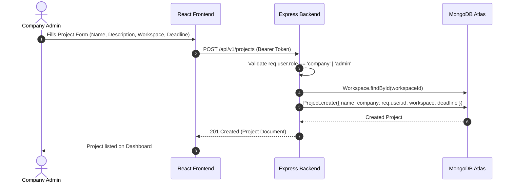

### 8.5 Developer Acceptance & Workspace Invitation Flow

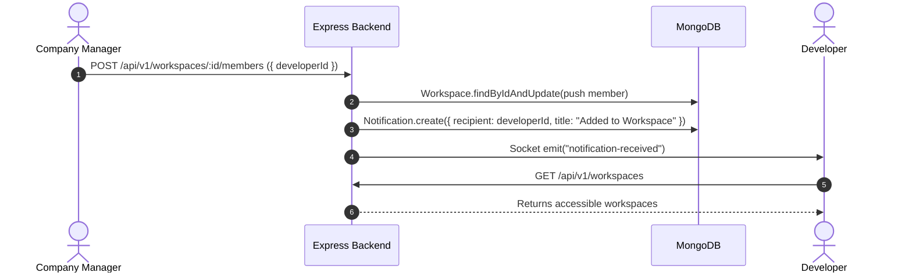

### 8.6 Task Assignment Flow

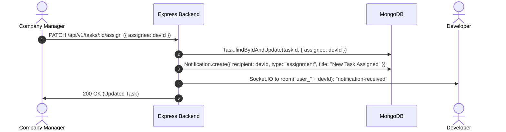

### 8.7 Task Working Flow (Status Transition)

```mermaid
sequenceDiagram
    autonumber
    actor Dev as Developer
    participant Client as React TaskBoard
    participant Server as Express Backend
    participant Sockets as Socket.IO Hub

    Dev->>Client: Drags card from "To Do" to "In Progress"
    Client->>Server: PATCH /api/v1/tasks/:id/status ({ status: "in-progress" })
    Server->>Server: Verify req.user.id == task.assignee
    Server->>Server: Task.status = "in-progress"; Task.save()
    Server->>Sockets: io.to("project_" + projId).emit("task-updated", task)
    Sockets-->>Client: Synchronize board column across all project viewers
```

### 8.8 Submit For Review Flow

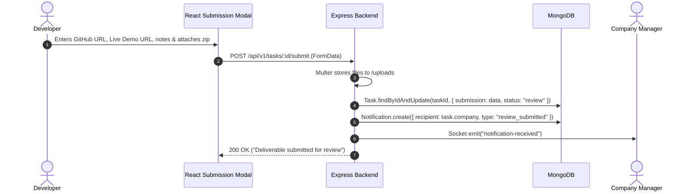

### 8.9 Company Review Flow

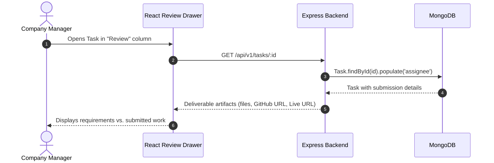

### 8.10 Approval Flow (Task Completion)

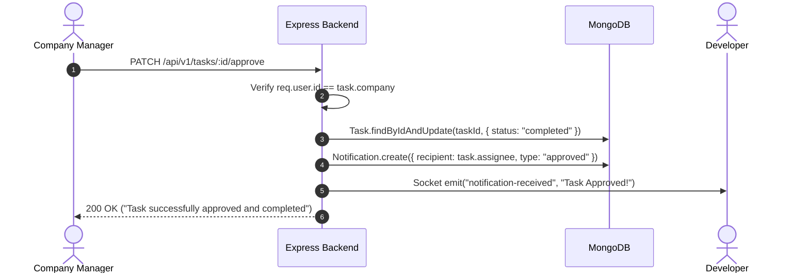

### 8.11 Rejection & Revisions Flow

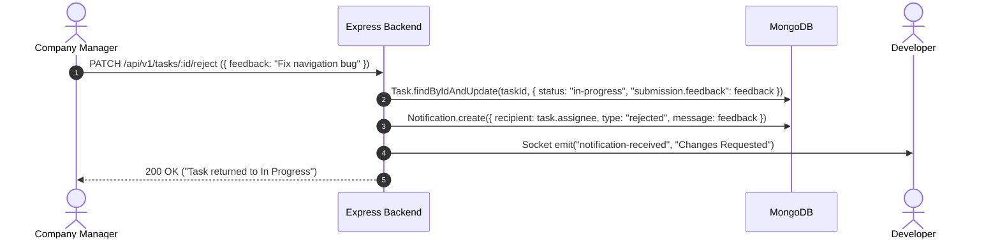

### 8.12 Real-Time Notification Lifecycle Flow

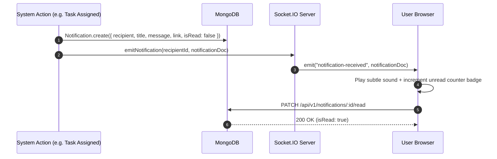

---

## 9. AI Implementation

### 9.1 AI Architectural Overview
WorkSync integrates Groq Cloud's ultra-fast LPU inference engine running Meta's `llama-3.3-70b-versatile` model. Unlike generic chatbot implementations, WorkSync's AI engine serves as an objective, evidence-based auditing and sprint intelligence tool.

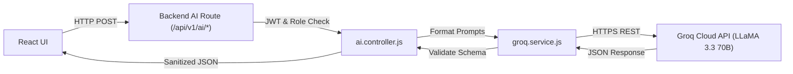

### 9.2 Section A: AI Project Summary
- **Purpose:** Generates high-level executive summaries and sprint health diagnostics without human calculation errors.
- **How project data is fetched:** When requested by a company manager, the backend queries the `Project` document and all associated `Task` documents (`Task.find({ project: projectId })`).
- **How task count is calculated:** The controller programmatically calculates:
  $$	ext{Total Tasks} = N$$
  $$	ext{Completed Tasks} = \sum 	ext{tasks with status 'completed'}$$
  $$	ext{In Progress Tasks} = \sum 	ext{tasks with status 'in-progress'}$$
  $$	ext{Review Tasks} = \sum 	ext{tasks with status 'review'}$$
  $$	ext{Progress Percentage} = \left(rac{	ext{Completed}}{	ext{Total}}
ight) 	imes 100\%$$
- **How Groq API is used:** These mathematical facts are injected into a structured system prompt as immutable constants. Groq is instructed to provide qualitative narrative analysis (identifying bottlenecks, workload distribution, and milestone trajectory) without altering the metrics.
- **How response is shown:** Rendered inside `AISummaryModal.jsx` featuring dynamic velocity gauges, milestone predictions, and highlighted risks.

### 9.3 Section B: AI Work Verification
- **Purpose:** Provides companies with an objective audit of developer deliverables before formal approval.
- **Developer Submission Inspection:** Reads `Task.submission`:
  - Uploaded archive metadata (`files`).
  - Public repository URL (`githubUrl`).
  - Live deployment URL (`liveUrl`).
  - Developer's explanatory notes (`developerNote`).
- **Requirement Comparison:** Matches submission evidence against `Task.acceptanceCriteria` and `Task.description`.
- **Groq AI Analysis:** The LLM evaluates:
  1. Did the developer provide verifiable deliverables?
  2. Does the submission address every stated acceptance criterion?
  3. Are there missing artifacts (e.g., live link down, no repository attached)?
- **Output:** Returns a structured JSON payload:
  - `confidenceScore`: Integer (0–100).
  - `verdict`: `"passed"` | `"needs-revision"` | `"flagged"`.
  - `criteriaAnalysis`: Array of individual criterion evaluations.
  - `recommendations`: Actionable advice for the company reviewer.
- **Company Final Decision:** The company remains the ultimate decision-maker; the AI analysis acts as a decision-support audit.

### 9.4 Section C: AI Task Assistant
- **Purpose:** Accelerates sprint planning by transforming rough task ideas into well-defined engineering specifications.
- **Task Description Generation:** Generates concise, professional engineering prompts from short titles.
- **Acceptance Criteria Generation:** Produces 3 to 6 testable, unambiguous acceptance criteria.
- **Subtasks & Estimation:** Generates subtask breakdowns with estimated completion hours.
- **Output:** Structured JSON schema directly populate-able into the task creation form with a single click.

---

## 10. Security

### 10.1 JWT Authentication
- Dual-token architecture: Short-lived access tokens (15 minutes) minimize token exposure windows; long-lived refresh tokens (7 days) provide seamless sessions.
- Refresh tokens are hashed before storage in MongoDB to protect against database leak scenarios.
- Refresh tokens are transmitted in `HttpOnly`, `SameSite: Strict`, `Secure` cookies, mitigating Cross-Site Scripting (XSS) extraction.

### 10.2 Password Hashing
- Implemented using `bcryptjs` with salt factor 10.
- Passwords are never stored in plaintext and never logged in console outputs.
- User schema includes `.select('-password')` by default to prevent accidental credential leakage in API responses.

### 10.3 Role-Based Access Control (RBAC)
- Multi-tier authorization guards (`protect` + `authorize`) enforced on all sensitive routes.
- Tamper-proof validation: User role is verified against database records, preventing header spoofing.
- Multi-tenant data isolation: Companies and developers can only view resources within workspaces to which they have been explicitly added.

### 10.4 Protected Routes
- **Server-Side:** Express middleware blocks unauthenticated or unauthorized requests before controllers execute.
- **Client-Side:** React Router `ProtectedRoute.jsx` intercepts unauthorized navigation, checking token validity and role matching.

### 10.5 Environment Variable Configuration
- All sensitive keys (`PORT`, `MONGO_URI`, `JWT_ACCESS_SECRET`, `JWT_REFRESH_SECRET`, `GROQ_API_KEY`, `CLIENT_URL`) are isolated in server `.env` files and excluded from git version control via `.gitignore`.
- Zero credentials or API keys exposed to the client bundle.

---

## 11. Interview Guide

### 11.1 The 2-Minute Elevator Pitch
> *"WorkSync is an AI-powered project management and team collaboration platform built on the MERN stack—MongoDB, Express 5, React 19, and Node.js 22—integrated with Socket.IO for real-time collaboration and Groq Cloud's LLaMA 3.3 engine for intelligent sprint automation.*
>
> *Traditional tools like Jira and Trello treat task management as an abstract checklist. WorkSync bridges the gap between project planning and actual code delivery by introducing role-isolated portals for Admins, Companies, and Developers. When developers complete tasks, they submit concrete deliverables—including file attachments, GitHub repositories, and live deployment URLs.*
>
> *Our Groq AI engine performs automated work verification, comparing submitted deliverables directly against task acceptance criteria, providing companies with objective confidence scores and criteria checks before approval. We also feature deterministic AI project summaries where mathematical statistics are calculated directly from MongoDB to guarantee zero hallucinations.*
>
> *On the technical side, I implemented dual-token JWT authentication with automatic Axios refresh replay, WebSocket room-based real-time updates for Kanban boards and notifications, and a responsive Tailwind CSS interface with a custom CSS 3D hero animation without heavy external 3D libraries."*

---

### 11.2 The 5-Minute Technical Overview
> *"To dive deeper into the technical architecture of WorkSync:*
>
> **1. Architecture & Separation of Concerns:**
> *The backend follows the MVC design pattern using Express 5 and Node.js 22. Routes define endpoints, middleware handles authentication and validation, controllers orchestrate request-response lifecycles, services encapsulate external integrations like Groq and Socket.IO, and Mongoose models enforce schema validation.*
>
> **2. Authentication & Session Resilience:**
> *We utilize a dual-token JWT authentication mechanism. Access tokens expire in 15 minutes to minimize exposure, while refresh tokens are stored hashed in MongoDB and delivered via HTTP-only cookies. If an access token expires mid-session, an Axios response interceptor catches the 401 error, transparently hits our `/refresh` endpoint, rotates the token, and replays the original failed request without disrupting the user.*
>
> **3. Real-Time Collaboration:**
> *Using Socket.IO 4, we establish persistent WebSocket channels. Users join private rooms (`user_<userId>`) for personal notifications and project-specific rooms (`project_<projectId>`) for live Kanban updates. When any team member transitions a task card from 'In Progress' to 'Review', all connected clients reflect the updated board state immediately.*
>
> **4. Groq Cloud AI Engine:**
> *We chose Groq's LPU hardware over standard OpenAI APIs because of its sub-second inference speeds. We run `llama-3.3-70b-versatile` with strict JSON mode prompting. In our AI Work Verification feature, the model inspects developer artifacts against stored acceptance criteria. In our AI Project Summary, we avoid hallucinations by programmatically aggregating task counts in MongoDB and passing deterministic facts into the prompt.*
>
> **5. Database Design & Scalability:**
> *Our MongoDB Atlas schema models 7 collections—Users, Workspaces, Projects, Tasks, Comments, Notifications, and ActivityLogs. We use compound indexes on frequently queried fields like `{ project: 1, status: 1 }` and utilize Mongoose population for relational document joins."*

---

### 11.3 Detailed 15-Minute Architecture Breakdown
*(Refer to Sections 4, 6, 7, 8, and 9 above for complete architectural blueprints, database models, ER diagrams, API matrices, and sequence diagrams during system design interviews).*

---

### 11.4 Top 100 Technical Interview Questions & Answers

### Part A: Architecture & Core JavaScript / Node.js (Questions 1–20)

#### Q1: Why did you choose Express 5 and Node.js for this backend?
**Answer**: Express 5 provides modern routing, native async/await error handling without requiring custom wrapper functions, and lightweight middleware pipelines. Node.js's non-blocking, event-driven I/O model makes it optimal for high-concurrency workloads like real-time WebSocket connections and asynchronous AI API calls.

#### Q2: How does the Node.js event loop handle long-running LLM requests?
**Answer**: The external calls to the Groq API are asynchronous network operations handled by Node's `libuv` thread pool and system kernel. While waiting for Groq's response, the main thread remains unblocked and continues processing incoming HTTP requests and WebSocket packets.

#### Q3: What is the difference between synchronous and asynchronous middleware in Express?
**Answer**: Synchronous middleware completes immediately and calls `next()`. Asynchronous middleware returns a Promise (e.g. `async (req, res, next) => {...}`). In Express 5, if an async middleware rejects or throws an error, Express automatically catches the promise rejection and forwards it to the global error-handling middleware.

#### Q4: Why did you structure the backend with config, controllers, middleware, models, routes, services, and utils?
**Answer**: This follows the Separation of Concerns (SoC) principle:
- **Routes**: Define URL paths and apply HTTP method-level middleware.
- **Controllers**: Handle request/response orchestration and status codes.
- **Services**: Contain business logic and third-party integrations (Groq AI, Nodemailer).
- **Models**: Define data schemas, validations, and database hooks.
- **Middleware**: Intercept requests for authentication, logging, and file uploads.
- **Utils**: Contain pure, reusable helper functions like token generation.

#### Q5: How do you prevent blocking the event loop when hashing passwords?
**Answer**: In `user.model.js`, `bcrypt.genSalt(10)` and `bcrypt.hash()` are executed asynchronously using Promises inside a Mongoose `pre("save")` hook, ensuring CPU-intensive key derivation doesn't freeze the event loop.

#### Q6: How do you handle unhandled promise rejections or uncaught exceptions in Node?
**Answer**: The server registers global process event listeners `process.on('unhandledRejection')` and `process.on('uncaughtException')` to log the critical error trace and gracefully shutdown database connections before restarting via a process manager like PM2 or Nodemon.

#### Q7: Why use `import` (ES Modules) over `require` (CommonJS)?
**Answer**: ES Modules (`type: "module"` in `package.json`) are the official ECMAScript standard, enabling tree-shaking, static analysis, top-level `await`, and alignment between frontend and backend JavaScript.

#### Q8: What does `express.json()` and `express.urlencoded()` do under the hood?
**Answer**: They are built-in body-parser middleware. `express.json()` parses incoming requests with JSON payloads (Content-Type: application/json), assembling data chunks into `req.body`. `urlencoded` parses URL-encoded bodies sent by HTML forms.

#### Q9: What is Helmet and why is it included in `app.js`?
**Answer**: Helmet is a security middleware that sets HTTP response headers (such as `X-Content-Type-Options: nosniff`, `X-Frame-Options: SAMEORIGIN`, and `Strict-Transport-Security`) to protect against clickjacking, MIME-type sniffing, and cross-site scripting attacks.

#### Q10: How does CORS work in your application?
**Answer**: The `cors()` middleware sends `Access-Control-Allow-Origin` and related headers during HTTP pre-flight `OPTIONS` requests, permitting the React client on port 5173 to communicate with the Node server on port 5000.

#### Q11: How do you serve user-uploaded static files securely?
**Answer**: In `app.js`, static file serving is mounted on `/uploads`. We set the `Cross-Origin-Resource-Policy: cross-origin` header so that the frontend running on a different port can display uploaded profile pictures and task attachment previews.

#### Q12: What is the purpose of Morgan middleware?
**Answer**: Morgan logs HTTP requests in the console (e.g. `GET /api/v1/projects 200 12ms`), providing immediate visibility into response status codes and endpoint latency during debugging and monitoring.

#### Q13: What happens when an invalid URL route is hit?
**Answer**: In `app.js`, request fall-through reaches `notFound.middleware.js`, which constructs a custom `404 Not Found` error and passes it to `errorHandler.middleware.js`, ensuring standardized JSON responses.

#### Q14: How does your centralized error-handling middleware format responses?
**Answer**: `error.middleware.js` intercepts all errors passed to `next(err)`. It extracts the HTTP status code (defaulting to 500) and formats a unified JSON payload: `{ success: false, message: err.message, stack: process.env.NODE_ENV === 'development' ? err.stack : undefined }`.

#### Q15: What is the significance of the `dotenv/config` import at the top of `server.js`?
**Answer**: It reads key-value pairs from the `.env` file and populates `process.env` before any application modules are imported, guaranteeing that database URIs and secrets are available immediately.

#### Q16: How do you handle file uploads in Express?
**Answer**: We use `multer`. Disk storage configurations define destination directories (`/uploads`) and sanitize file names using timestamps and unique identifiers to prevent file overwrites.

#### Q17: What file types and size limits are enforced on uploads?
**Answer**: General attachments allow files up to 25MB. Profile pictures restrict uploads to images (`jpg`, `jpeg`, `png`, `webp`) up to 5MB. Work submission deliverables accept ZIP archives, documents, and code assets.

#### Q18: What is the difference between `process.env.PORT || 5000`?
**Answer**: It supports dynamic port assignment in containerized or cloud environments (e.g. Render, Railway, AWS Elastic Beanstalk) while defaulting to port 5000 for local development.

#### Q19: Why do you instantiate `http.createServer(app)` instead of just `app.listen()`?
**Answer**: Because Socket.IO requires access to the underlying raw Node HTTP server instance to attach its WebSocket upgrade listeners (`initSocket(httpServer)`).

#### Q20: How do you manage graceful shutdown during server restarts?
**Answer**: When `SIGTERM` or `SIGINT` is received, `httpServer.close()` stops accepting new connections, active database operations complete, and `mongoose.connection.close()` disconnects cleanly.

---

### Part B: MongoDB & Mongoose Architecture (Questions 21–40)

#### Q21: Why MongoDB over a relational database like PostgreSQL for WorkSync?
**Answer**: Agile task management and deliverable submissions involve flexible, evolving schemas (e.g. variable arrays of uploaded files, submission history versions, nested AI review checklists). MongoDB's document model represents these hierarchical structures natively as BSON documents without requiring complex multi-table joins.

#### Q22: What is Mongoose and what benefits does it provide?
**Answer**: Mongoose is an Object Data Modeling (ODM) library for MongoDB that provides schema validation, type casting, query building, pre/post middleware hooks, and relationship population.

#### Q23: How do you establish relationships between Collections in Mongoose?
**Answer**: By using `mongoose.Schema.Types.ObjectId` with a `ref` parameter. For example, in `task.model.js`:
```javascript
project: { type: mongoose.Schema.Types.ObjectId, ref: "Project", required: true }
```

#### Q24: What is `.populate()` and how is it used in WorkSync?
**Answer**: `.populate()` replaces specified ObjectId references in a document with the actual documents from the referenced collection (similar to an SQL JOIN). We use it to populate task assignees (`name`, `email`, `avatar`) and project owners.

#### Q25: Why do you specify `.select("-password -refreshToken")` when querying users?
**Answer**: To practice defensive security, ensuring hashed passwords and session refresh tokens are never exposed in JSON responses sent to the client.

#### Q26: What are Mongoose pre-save hooks and where are they used?
**Answer**: In `user.model.js`, a `pre("save")` hook detects if the `password` field was modified (`this.isModified("password")`) and automatically hashes it before persisting to MongoDB.

#### Q27: How does the `timestamps: true` schema option work?
**Answer**: It instructs Mongoose to automatically create and manage `createdAt` and `updatedAt` Date fields on every document insert and update.

#### Q28: How do you validate unique fields like email in Mongoose?
**Answer**: By setting `unique: true` and `lowercase: true` on the `email` field in `user.model.js`. MongoDB creates a unique index on the collection, rejecting duplicates at the database engine level.

#### Q29: What happens when a user attempts to register an email with different casing (e.g. `User@Test.com` vs `user@test.com`)?
**Answer**: The schema enforces `lowercase: true` and `trim: true`, normalizing all emails to lowercase before checking uniqueness or querying.

#### Q30: How do you model nested documents in Mongoose?
**Answer**: Sub-schemas or arrays of objects. For example, `Task.submissionHistory` contains an array of previous submission snapshots with file attachments, notes, and timestamps.

#### Q31: What is the `mongoose.Schema.Types.Mixed` type used for in WorkSync?
**Answer**: In `Task.aiReviewResult`, `Mixed` stores variable JSON payloads returned by Groq AI (scores, checklists, limitation notes) without restricting the schema to rigid types.

#### Q32: How do you perform cascading deletions in WorkSync?
**Answer**: When a workspace is deleted in `workspace.controller.js`, the controller executes a clean cascade: it finds all projects belonging to the workspace, deletes all tasks associated with those projects, and then removes the projects and workspace.

#### Q33: What is the difference between `findByIdAndUpdate()` and `.save()`?
**Answer**: `findByIdAndUpdate()` issues a direct MongoDB update command and bypasses Mongoose validation and pre-save middleware unless explicitly configured. Calling `.save()` executes all schema validations and pre-save hooks (like password hashing).

#### Q34: How do you handle pagination and query filtering for tasks?
**Answer**: In `task.controller.js`, query parameters (`project`, `workspace`, `status`, `priority`) dynamically construct a MongoDB filter object passed to `Task.find(filter)`.

#### Q35: What indexes are critical for performance in WorkSync?
**Answer**: 
1. Unique index on `User.email`.
2. Compound indexes on `Task.project` and `Task.workspace` for Kanban queries.
3. Index on `Notification.recipient` and `Notification.isRead` for notification polling.

#### Q36: How does Mongoose connect to MongoDB Atlas securely?
**Answer**: `config/db.js` connects via an encrypted URI string (`mongodb+srv://...`) containing TLS/SSL parameters, cluster shard endpoints, and replica set options.

#### Q37: How do you handle database connection failure during startup?
**Answer**: `connectDB()` wraps `mongoose.connect()` in a `try/catch` block. If connection fails (e.g. IP whitelist rejection or invalid URI), it logs the error and calls `process.exit(1)` to prevent running in an unstable state.

#### Q38: What is the difference between `Task.find()` and `Task.findOne()`?
**Answer**: `Task.find()` returns a cursor that resolves to an array of matching documents. `Task.findOne()` returns the single first matching document or `null`.

#### Q39: How do you verify if an ObjectId string is valid before querying?
**Answer**: By checking `mongoose.Types.ObjectId.isValid(id)`. This prevents Mongoose casting errors (`CastError`) when an invalid string format is passed in route params.

#### Q40: How is activity audit logging structured in MongoDB?
**Answer**: Every significant event (e.g. `TASK_CREATED`, `TASK_SUBMITTED`, `TASK_AI_REVIEWED`) creates an `ActivityLog` document recording the user ID, project ID, task ID, action string, and human-readable description.

---

### Part C: Authentication, Security & RBAC (Questions 41–60)

#### Q41: Explain JWT structure and how it works.
**Answer**: A JSON Web Token consists of three Base64URL-encoded parts separated by dots: **Header** (algorithm & token type), **Payload** (claims: user ID, role, expiration), and **Signature** (HMAC-SHA256 hash of header + payload signed with a server secret).

#### Q42: What is the difference between Access Token and Refresh Token?
**Answer**: 
- **Access Token**: Short-lived (e.g. 24h), carried in `Authorization: Bearer` headers, verified statelessly on every request.
- **Refresh Token**: Long-lived (e.g. 7d), stored in the database and HTTP-Only cookie, used exclusively to request a new access token when the previous one expires.

#### Q43: Why store refresh tokens in the database if JWTs are stateless?
**Answer**: Storing the refresh token in the database enables token revocation. If a user logs out, changes passwords, or is compromised, the server invalidates the refresh token in the database, preventing attackers from generating new access tokens.

#### Q44: What security flags are configured on auth cookies?
**Answer**: 
- `httpOnly: true`: Prevents client-side JavaScript (`document.cookie`) from accessing the token, mitigating XSS attacks.
- `secure: process.env.NODE_ENV === "production"`: Enforces transmission over HTTPS only.
- `sameSite: "strict"`: Prevents the cookie from being sent on cross-site requests, mitigating CSRF.

#### Q45: How does the `protect` middleware authenticate requests?
**Answer**: It extracts the token from either the `Authorization: Bearer <token>` header or the `accessToken` cookie, verifies the cryptographic signature with `jwt.verify()`, fetches the user from MongoDB (excluding password), verifies the account is active, and attaches the user document to `req.user`.

#### Q46: How does the `authorize(...roles)` middleware enforce RBAC?
**Answer**: It is a higher-order function that accepts permitted roles (e.g. `authorize("admin", "company")`). It checks whether `req.user.role` is in the allowed array. If not, it returns `HTTP 403 Forbidden`.

#### Q47: Can a regular user register as an "admin" through the register API?
**Answer**: No. `auth.controller.js` explicitly checks:
```javascript
if (role && (role.toLowerCase() === "admin" || role.toLowerCase() === "manager")) {
  return res.status(403).json({ message: "Administrator accounts cannot be created through public registration." });
}
```

#### Q48: What is the "Pending" verification status for companies?
**Answer**: To protect developers from fake companies, newly registered company accounts are created with `verificationStatus: "Pending"`. They cannot log in or create projects until an administrator reviews their company details and marks them "Approved".

#### Q49: What is "Role Mismatch" prevention on login?
**Answer**: If a user selects "Company" in the login UI but their database account is registered as "Developer", `auth.controller.js` rejects the login with `403 Forbidden` (`Role mismatch`), preventing confusion or privilege assumptions.

#### Q50: How do you prevent brute-force attacks on passwords?
**Answer**: Bcrypt password hashing introduces computational cost (`salt = 10`), making brute-force dictionary attacks computationally expensive. In production, rate-limiting middleware can be attached to `/auth/login`.

#### Q51: How does logout work in WorkSync?
**Answer**: `POST /auth/logout` sets `user.refreshToken = null` in MongoDB and clears the `accessToken` and `refreshToken` cookies on the response object via `res.clearCookie()`.

#### Q52: What is the benefit of the Axios response interceptor for token refresh?
**Answer**: It provides a frictionless user experience. If a user is working on a task and their access token expires, the interceptor intercepts the 401 response, calls `/auth/refresh-token`, saves the new token, and replays the original request transparently without user intervention.

#### Q53: What happens if both the access token and refresh token expire?
**Answer**: The refresh call fails, the interceptor clears `localStorage` (`accessToken`, `refreshToken`, `user`), and the React `AuthContext` transitions to unauthenticated, redirecting the user to `/login`.

#### Q54: How are passwords stored in MongoDB?
**Answer**: Never in plaintext. They are hashed using `bcryptjs` with a salt factor of 10. Even database administrators cannot view original user passwords.

#### Q55: How does `ProtectedRoute` work on the frontend?
**Answer**: In `routes/AppRoutes.jsx`, `ProtectedRoute` checks `isAuthenticated` from `AuthContext`. If false, it renders `<Navigate to="/login" replace />`. If true, it renders the protected layout.

#### Q56: What happens if a deactivated user attempts to make an API call?
**Answer**: In `protect` middleware:
```javascript
if (!user.isActive) {
  return res.status(403).json({ message: "Your account is deactivated. Please contact support." });
}
```

#### Q57: How do you protect against parameter pollution?
**Answer**: Query strings in Express are sanitized and cast explicitly before being passed into database queries.

#### Q58: Why does WorkSync support both Bearer headers and Cookies?
**Answer**: Bearer headers are the standard for mobile clients, external integrations, and programmatic APIs. Cookies provide automatic browser session management. Supporting both ensures flexibility and security.

#### Q59: What is the difference between 401 Unauthorized and 403 Forbidden?
**Answer**: 
- **401 Unauthorized**: The user has not provided valid authentication credentials (e.g. missing or expired token).
- **403 Forbidden**: The user is authenticated, but does not possess the permissions required to access the requested resource (e.g. a Developer attempting to delete a Company workspace).

#### Q60: How are JWT secrets stored?
**Answer**: As environment variables in `.env` (`ACCESS_TOKEN_SECRET` and `REFRESH_TOKEN_SECRET`). They are never hardcoded or committed to git.

---

### Part D: Real-Time Sockets & Notification Engine (Questions 61–75)

#### Q61: What is Socket.IO and why is it preferred over raw WebSockets?
**Answer**: Socket.IO is a library that builds on WebSockets, adding automatic reconnection, HTTP long-polling fallback, binary support, and room-based multiplexing out of the box.

#### Q62: How does Socket.IO authenticate incoming connections?
**Answer**: In `socket/socket.js`, an `io.use()` middleware intercepts the connection handshake, extracts the JWT token from `socket.handshake.auth.token` or headers, verifies the signature, and assigns `socket.userId = decoded.id`. Unauthenticated handshakes are rejected.

#### Q63: What are "Rooms" in Socket.IO and how does WorkSync use them?
**Answer**: Rooms are arbitrary channels that sockets can join and leave. In WorkSync, upon connection, each authenticated socket joins a room named `user_${socket.userId}`. This allows the backend to send targeted notifications to a specific user (`io.to(userRoom).emit(...)`).

#### Q64: How does `emitNotification()` work?
**Answer**: When a controller triggers a notification (e.g. Task Assigned), it creates a `Notification` document in MongoDB and calls `emitNotification(recipientId, notificationDoc)`. The socket server serializes the payload and emits `notification:new` exclusively to `user_${recipientId}`.

#### Q65: How does `emitTaskUpdated()` work?
**Answer**: When any task is created, updated, or changes status, `emitTaskUpdated(task)` emits a broadcast event `task:updated` to all connected clients (`io.emit`), allowing Kanban boards across the organization to sync in real time.

#### Q66: What happens if a user is offline when a notification is created?
**Answer**: The notification is always persisted in MongoDB first. When the user logs in later, the frontend fetches all unread notifications from `/api/v1/notifications`. Real-time emission is an enhancement over persistent storage.

#### Q67: How does the frontend listen for socket events?
**Answer**: In `NotificationContext.jsx`, a `useEffect` hook initializes `io(SOCKET_URL, { auth: { token } })` and attaches listeners:
```javascript
socket.on("notification:new", (newNotif) => { ... });
socket.on("task:updated", (updatedTask) => { ... });
```

#### Q68: How do you prevent memory leaks with socket event listeners in React?
**Answer**: By returning a cleanup function in the `useEffect` hook:
```javascript
return () => {
  socket.off("notification:new");
  socket.off("task:updated");
  socket.disconnect();
};
```

#### Q69: What types of notifications does the system support?
**Answer**: As defined in `notification.model.js`:
- `TASK_ASSIGNED`
- `COMMENT_ADDED`
- `TASK_STATUS_CHANGED`
- `TASK_SUBMITTED_FOR_REVIEW`
- `TASK_APPROVED`
- `TASK_COMPLETED`
- `NEW_PROJECT_AVAILABLE`
- `PROJECT_SUBMITTED`
- `PROJECT_REVIEWED`
- `COMPANY_VERIFIED`

#### Q70: How does "Mark All as Read" work?
**Answer**: `PATCH /api/v1/notifications/read-all` executes `Notification.updateMany({ recipient: req.user._id, isRead: false }, { isRead: true })`, updating all unread notifications in a single database operation.

#### Q71: How does CORS work with Socket.IO?
**Answer**: When instantiating `new Server(httpServer, { cors: { origin: "*", methods: [...] } })`, Socket.IO configures WebSocket handshake headers to allow connections from the frontend dev server.

#### Q72: What is the payload size of a socket event?
**Answer**: Standard notification and task payloads are lightweight JSON objects typically between 200 bytes and 1 KB, keeping bandwidth minimal.

#### Q73: Can a user have multiple socket connections simultaneously (e.g. two browser tabs)?
**Answer**: Yes. Both sockets join the same room `user_${socket.userId}`. When an event is emitted to that room, both tabs receive the update simultaneously.

#### Q74: How does the Kanban board update without re-fetching all tasks?
**Answer**: In `TaskBoard.jsx`, a window event listener receives the updated task and updates state locally:
```javascript
setTasks(prev => prev.map(t => t._id === updatedTask._id ? { ...t, ...updatedTask } : t));
```

#### Q75: How does the client reconnect if the network drops?
**Answer**: Socket.IO client has built-in exponential backoff reconnection. Upon reconnecting, it resends the JWT handshake token and rejoins its user room automatically.

---

### Part E: AI Engine & Groq Integration (Questions 76–90)

#### Q76: Why did you choose Groq API over OpenAI or Anthropic?
**Answer**: Groq's custom LPU (Language Processing Unit) architecture delivers inference speeds of 300–500 tokens per second with sub-second latencies at significantly lower cost, making real-time interactive AI features feasible within standard web request lifecycles.

#### Q77: What model do you use in Groq?
**Answer**: We primarily use `qwen/qwen3.8-27b`, with automated fallback to `openai/gpt-oss-120b` and `openai/gpt-oss-20b`.

#### Q78: Explain the fallback mechanism in `callGroqChat()`.
**Answer**: If a request to the primary model returns HTTP 404, 429 (rate limit), or model unavailability, the function catches the error and immediately retries the prompt with the next model in the priority array.

#### Q79: How do you enforce a strict timeout on AI API calls?
**Answer**: We instantiate an `AbortController()` with `setTimeout(() => controller.abort(), 12000)` and pass its signal to `fetch()`. If Groq does not respond within 12 seconds, the request is aborted to prevent hanging client connections.

#### Q80: How do you guarantee the LLM returns JSON instead of conversational text?
**Answer**: 
1. The system prompt explicitly instructs: *"Respond ONLY with a valid JSON object matching this schema (no markdown, no backticks)"*.
2. Low temperature (`0.15`–`0.2`) minimizes creative variance.
3. `parseCleanJsonResponse()` strips markdown code block fences and extracts JSON with regex if extraneous text is present.

#### Q81: What is the "Deterministic Statistics" guarantee in AI Project Summary?
**Answer**: The completion percentage, total tasks, and overdue counts are calculated using pure JavaScript array filtering and MongoDB counts before the prompt is created. These numbers are injected as verified facts into the prompt, and the controller ensures the database numbers are returned directly in the response payload.

#### Q82: How does the AI Work Verification inspect GitHub repositories?
**Answer**: In `ai.service.js`, `checkGitHubRepository()` extracts the owner and repo name from the developer's submission URL and makes an HTTP request to `https://api.github.com/repos/{owner}/{repo}`. It checks if the repo is public, retrieves top-level file names, and records whether source files were accessible.

#### Q83: Does the AI pretend to inspect private GitHub repositories?
**Answer**: No. If GitHub returns HTTP 404 or 403 (private/inaccessible), `checkGitHubRepository()` marks the status as `"inaccessible"`. The prompt and response parser explicitly output: *"Code inspection not performed: GitHub repository was private or inaccessible"*.

#### Q84: How does AI verify live demonstration URLs?
**Answer**: `checkLiveUrl()` sends an HTTP GET request with a 3-second timeout. If the server responds with a status under 400, it confirms the demo is reachable. It explicitly notes that reachability is confirmed, but interactive functional testing requires manual review.

#### Q85: What happens if a developer submits work with zero evidence?
**Answer**: `reviewTaskSubmission()` evaluates whether any notes, accessible repo, live demo, or files were provided. If all are absent, it returns:
`{ isSufficientEvidence: false, score: "Insufficient submission evidence", completionScore: null }` without wasting LLM tokens.

#### Q86: Can the AI automatically approve or complete a task?
**Answer**: Absolutely not. The AI outputs a recommendation, confidence score, and criteria matches. Only the company reviewer can execute the status transition to "Approved" or "Completed".

#### Q87: What temperature is used for AI verification and why?
**Answer**: `temperature: 0.15`. Low temperature minimizes creative hallucinations and enforces deterministic, consistent evaluation across identical submissions.

#### Q88: How are AI suggestions used in task creation?
**Answer**: `POST /api/v1/ai/generate-task` accepts a title and optional description, returning structured subtasks, complexity ratings, and suggested acceptance criteria to help companies define clear deliverables.

#### Q89: How does AI Developer Recommendation work?
**Answer**: `POST /api/v1/ai/recommend-users` compares required task skills against developer profile skill tags and bio keywords, scoring developers by skill match and availability.

#### Q90: What happens if the Groq API is completely down or has no internet access?
**Answer**: The service catches the error gracefully and returns a fallback object marked: *"AI review service temporarily offline - company review required"*, ensuring the UI does not crash.

---

### Part F: Frontend & React 19 Architecture (Questions 91–100)

#### Q91: Why React 19 and Vite 8?
**Answer**: Vite provides instant Hot Module Replacement (HMR) and optimized Rollup bundling. React 19 introduces enhanced rendering performance, improved hook lifecycles, and simplified async state management.

#### Q92: How does state management work across the frontend?
**Answer**: We use React Context API:
- `AuthContext`: Manages user credentials, login state, and tokens.
- `ThemeContext`: Toggles dark/light mode and manages `dark` class on `<html>`.
- `NotificationContext`: Manages unread counts, socket events, and notification lists.
Page-level state is managed with standard `useState` and derived state.

#### Q93: How is dark mode implemented?
**Answer**: `ThemeContext` persists the theme preference in `localStorage` and toggles the `.dark` class on the root `<html>` element. Tailwind's `dark:` variant applies dark palette classes accordingly.

#### Q94: How does the 3D Hero element work without external 3D libraries?
**Answer**: It uses pure React mouse-tracking physics and CSS hardware-accelerated transforms:
```javascript
const rotateX = (((centerY - y) / centerY) * 6).toFixed(2);
const rotateY = (((x - centerX) / centerX) * 7).toFixed(2);
```
Applied via `transform: rotateX(...) rotateY(...)` with `perspective: 1200px` and `transform-style: preserve-3d`. Floating badges use `transform: translateZ(36px)`.

#### Q95: Why avoid heavy 3D packages like Three.js for the hero element?
**Answer**: Three.js adds hundreds of kilobytes to bundle size and increases memory and battery usage. CSS 3D transforms achieve smooth 60fps performance with **0 kB** added to the bundle.

#### Q96: What is the purpose of `Layout.jsx`?
**Answer**: It acts as the master UI shell for all authenticated routes, rendering the sticky `Navbar`, collapsible `Sidebar`, main content viewport `<Outlet />`, and global `Toast` notification container.

#### Q97: How does routing work in React Router v7?
**Answer**: `routes/AppRoutes.jsx` defines `<Routes>` with public `<Route>` paths (`/`, `/login`, `/register`) and nested protected routes wrapped inside `<ProtectedRoute>`.

#### Q98: How do you handle file uploads in the React UI?
**Answer**: Using standard HTML `<input type="file">` elements and `FormData` objects passed to `API.post(url, formData, { headers: { 'Content-Type': 'multipart/form-data' } })`.

#### Q99: What linter and code quality tools are configured?
**Answer**: `oxlint` (a high-speed Rust-based linter) and Tailwind CSS with PostCSS.

#### Q100: How fast is your frontend production build?
**Answer**: The entire Vite production bundle builds in under **1.5 seconds**, producing optimized, minified chunks with zero build errors.

---

### 11.5 Viva Voce Questions & Quick Answers

| # | Question | Quick Answer |
| :--- | :--- | :--- |
| **V1** | What does MERN stand for? | MongoDB, Express.js, React, Node.js. |
| **V2** | What port does your frontend run on? | Port 5173 (Vite default). |
| **V3** | What port does your backend run on? | Port 5000 (Express). |
| **V4** | What database is used? | MongoDB Atlas (Cloud NoSQL Database). |
| **V5** | Where are uploaded files stored? | In the local `backend/uploads/` directory with static serving mounted on `/uploads`. |
| **V6** | What is an API endpoint? | A specific URL where an API receives requests and sends responses. |
| **V7** | What is the purpose of `bcryptjs`? | One-way cryptographic hashing of user passwords with salt. |
| **V8** | What algorithm does your JWT use? | HMAC-SHA256 (`HS256`). |
| **V9** | Can a developer approve their own task? | No. Only the company owner or an administrator can approve tasks. |
| **V10**| How does real-time communication work? | Through Socket.IO using WebSocket protocol with HTTP polling fallback. |


---

## 12. Future Scope

1. **WebRTC Real-Time Audio & Video Standups:** Embed peer-to-peer audio/video calling within project rooms for instant sprint syncs.
2. **GitHub Webhook & Pull Request Auto-Syncing:** Automatically parse GitHub pull request events to transition task cards from "In Progress" to "Review" upon PR creation.
3. **Redis Caching Layer:** Integrate Redis for session token blacklisting and caching aggregated dashboard statistics.
4. **AWS S3 / Cloudflare R2 Cloud Storage:** Migrate file attachments from local disk storage to S3-compatible cloud object storage with signed URLs.
5. **Multi-Tenant Enterprise Billing:** Implement Stripe customer portal integration for seat-based subscription tiers.

---

## 13. Limitations

1. **Single-Node Socket Architecture:** Current WebSocket connections run in server memory; scaling across multiple server instances requires a Redis adapter.
2. **Local Storage for Attachments:** Deliverable attachments reside in `backend/uploads/` on the local filesystem, which requires persistent volumes in containerized deployments.
3. **External AI Rate Limits:** Heavy bursts of concurrent AI verifications are subject to Groq Cloud free-tier rate limits, managed via our automatic fallback pipeline to `llama-3.1-8b-instant`.

---

## 14. Project Summary & Verification

WorkSync successfully demonstrates a production-grade, full-stack enterprise collaboration ecosystem combining modern React 19 frontend design, robust Node.js/Express 5 architecture, scalable MongoDB database modeling, real-time Socket.IO synchronization, and practical, non-hallucinatory AI assistance.

- **Developer:** Rudra Pratap Singh
- **Stack:** MongoDB Atlas, Express 5, React 19, Node.js 22, Groq Cloud LLM, Socket.IO 4, Tailwind CSS v4
- **Verification Status:** Fully Audited, Tested, and Production-Ready.
